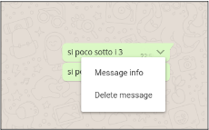

Boolzapp
===

## CONSEGNA

### **Milestone 1**
- **Replica della grafica** con la possibilità di avere messaggi scritti dall’utente (verdi) e dall’interlocutore (bianco) assegnando due classi CSS diverse
- **Visualizzazione dinamica della lista contatti**: tramite la direttiva v-for, visualizzare nome e immagine di ogni contatto

### **Milestone 2**
- **Visualizzazione dinamica dei messaggi**: tramite la direttiva v-for, visualizzare tutti i messaggi relativi al contatto attivo all’interno del pannello della conversazione
- **Click sul contatto** mostra la conversazione del contatto cliccato

### **Milestone 3**
- **Aggiunta di un messaggio**: l’utente scrive un testo nella parte bassa e digitando “enter” il testo viene aggiunto al thread sopra, come messaggio verde
- **Risposta dall’interlocutore**: ad ogni inserimento di un messaggio, l’utente riceverà un “ok” come risposta, che apparirà dopo 1 secondo.

### **Milestone 4**
- **Ricerca utenti**: scrivendo qualcosa nell’input a sinistra, vengono visualizzati solo i contatti il cui nome contiene le lettere inserite (es, Marco, Matteo Martina -> Scrivo “mar” rimangono solo Marco e Martina)

### **Milestone 5 - opzionale**
- **Cancella messaggio**: cliccando sul messaggio appare un menu a tendina che permette di cancellare il messaggio selezionato

- **Visualizzazione ora e ultimo messaggio inviato/ricevuto** nella lista dei contatti 

>Consigli utili:
- Si possono trascurare le scrollbar verticali, sia nel pannello dei messaggi, che nella lista dei contatti
- I pulsanti e le icone possono non funzionare (a parte l’invio del messaggio)
- Per gestire le date, può essere utile la libreria Luxon
- La struttura dell’array dei contatti potrebbe avere questa forma:

```
contacts: [
        {
          name: 'Michele',
          avatar: 'assets/IMG/avatar/avatar_1.jpg',
          visible: true,
          messages: [
            {
              date: '10/01/2020 15:30:55',
              message: 'Hai portato a spasso il cane?',
              status: 'sent'
            },
            {
              date: '10/01/2020 15:50:00',
              message: 'Ricordati di stendere i panni',
              status: 'sent'
            },
            {
              date: '10/01/2020 16:15:22',
              message: 'Tutto fatto!',
              status: 'received'
            }
          ],
        },
        {
          name: 'Fabio',
          avatar: 'assets/IMG/avatar/avatar_2.jpg',
          visible: true,
          messages: [
            {
              date: '20/03/2020 16:30:00',
              message: 'Ciao come stai?',
              status: 'sent'
            },
            {
              date: '20/03/2020 16:30:55',
              message: 'Bene grazie! Stasera ci vediamo?',
              status: 'received'
            },
            {
              date: '20/03/2020 16:35:00',
              message: 'Mi piacerebbe ma devo andare a fare la spesa.',
              status: 'sent'
            }
          ],
        },
        {
          name: 'Samuele',
          avatar: 'assets/IMG/avatar/avatar_3.jpg',
          visible: true,
          messages: [
            {
              date: '28/03/2020 10:10:40',
              message: 'La Marianna va in campagna',
              status: 'received'
            },
            {
              date: '28/03/2020 10:20:10',
              message: 'Sicuro di non aver sbagliato chat?',
              status: 'sent'
            },
            {
              date: '28/03/2020 16:15:22',
              message: 'Ah scusa!',
              status: 'received'
            }
          ],
        },
        {
          name: 'Alessandro B.',
          avatar: 'assets/IMG/avatar/avatar_4.jpg',
          visible: true,
          messages: [
            {
              date: '10/01/2020 15:30:55',
              message: 'Lo sai che ha aperto una nuova pizzeria?',
              status: 'sent'
            },
            {
              date: '10/01/2020 15:50:00',
              message: 'Si, ma preferirei andare al cinema',
              status: 'received'
            }
          ],
        },
        {
          name: 'Alessandro L.',
          avatar: 'assets/IMG/avatar/avatar_5.jpg',
          visible: true,
          messages: [
            {
              date: '10/01/2020 15:30:55',
              message: 'Ricordati di chiamare la nonna',
              status: 'sent'
            },
            {
              date: '10/01/2020 15:50:00',
              message: 'Va bene, stasera la sento',
              status: 'received'
            }
          ],
        },
        {
          name: 'Claudia',
          avatar: 'assets/IMG/avatar/avatar_6.jpg',
          visible: true,
          messages: [
            {
              date: '10/01/2020 15:30:55',
              message: 'Ciao Claudia, hai novità?',
              status: 'sent'
            },
            {
              date: '10/01/2020 15:50:00',
              message: 'Non ancora',
              status: 'received'
            },
            {
              date: '10/01/2020 15:51:00',
              message: 'Nessuna nuova, buona nuova',
              status: 'sent'
            }
          ],
        },
        {
          name: 'Federico',
          avatar: 'assets/IMG/avatar/avatar_7.jpg',
          visible: true,
          messages: [
            {
              date: '10/01/2020 15:30:55',
              message: 'Fai gli auguri a Martina che è il suo compleanno!',
              status: 'sent'
            },
            {
              date: '10/01/2020 15:50:00',
              message: 'Grazie per avermelo ricordato, le scrivo subito!',
              status: 'received'
            }
          ],
        },
        {
          name: 'Davide',
          avatar: 'assets/IMG/avatar/avatar_8.jpg',
          visible: true,
          messages: [
            {
              date: '10/01/2020 15:30:55',
              message: 'Ciao, andiamo a mangiare la pizza stasera?',
              status: 'received'
            },
            {
              date: '10/01/2020 15:50:00',
              message: 'No, l\'ho già mangiata ieri, ordiniamo sushi!',
              status: 'sent'
            },
            {
              date: '10/01/2020 15:51:00',
              message: 'OK!!',
              status: 'received'
            }
          ],
        }
      ]

```

## STEPS
### **Milestone 1**
1. Creare cartelle html e css e replicare la grafica
2. Creare file script e aggiungerela lista contatti con un ciclo `v-for`
### **Milestone 2**
1. Agire nel `main .content` e creare un ciclo `v-for` per inserire i messaggi e poterli visualizzare
2. Utilizzando l'indice e lo status dei messaggi inserire la classe relativa al messaggio per distinguere se è stato inviato o ricevuto
3. Agire nel `aside .chats-made` ed utilizzare l'indice del ciclo per cambiare la visualizzazine delle chat come abbiamo fatto per l'esercizio dello slider

### **Milestone 3**
1. Agire nel camput `input` "Scrivi un messaggio" e come nell'esercizio **todolist** prendere il testo inserito e pusharlo nell'array dei messaggi
2. Sistemare l'orario del messaggio inviato con luxon
3. Creare un messaggio preimpostato che si genererà ad ogni messaggio inviato con un setTimeout dopo un secondo

### **Milestone 4**
>OSSERVAZIONI: 

la richiesta è: _scrivendo qualcosa nell’input, vengono visualizzati solo i contatti il cui nome contiene le lettere inserite_ ma di default i contatti vengono visualizzati tutti e nello script oer oggi contatto abbiamo una proprietà `visible: true,` perciò mi viene da pensare che utilizzando un `v-if` all'elemento della lista potremmo visualizzarli solo quando le lettere inserite nel campo di input combaciano col nome. Per far combaciare le lettere inserite col nome dei contatti **FORSE** devo scomporre tutti i nomi in singole lettere `(come l'esercizio delle parole palindrome)` e se le lettere inserite combaciano con queste singole lettere allora rendo l'elemento visibile
